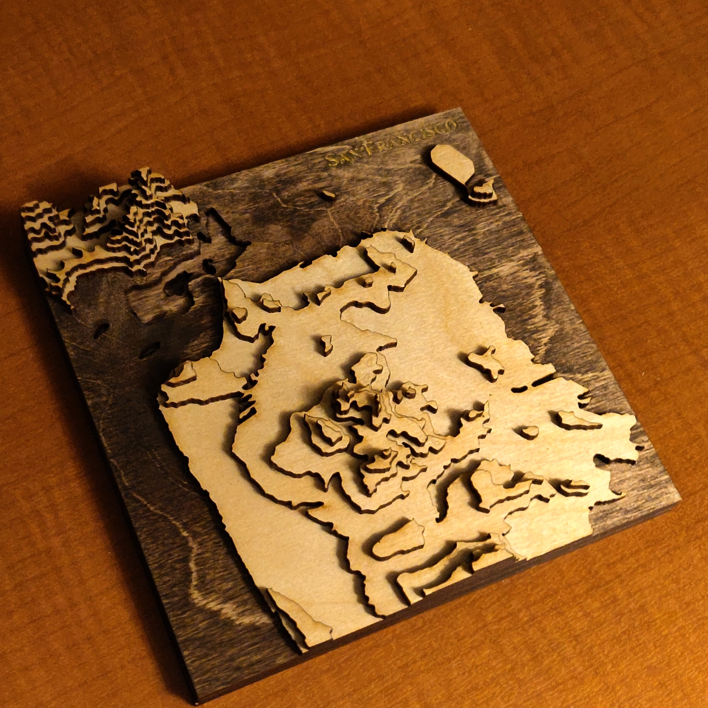
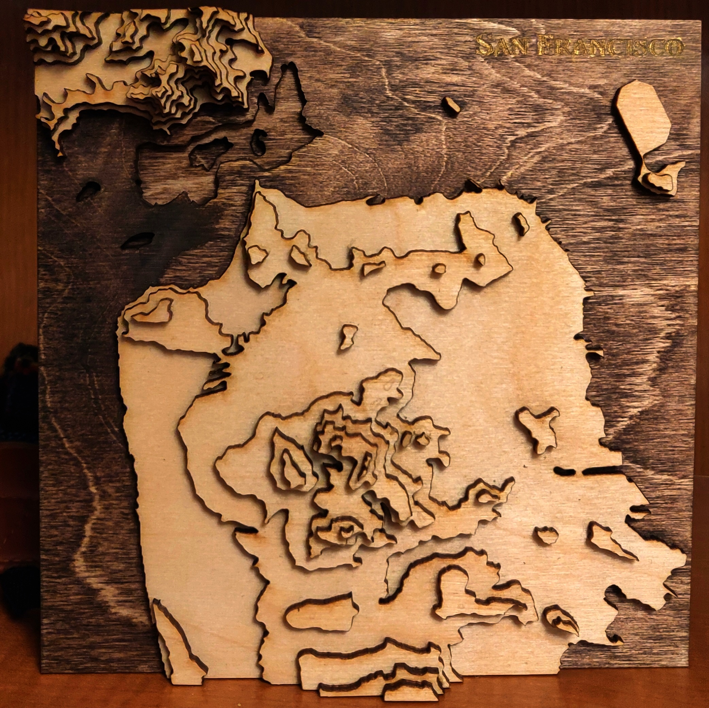
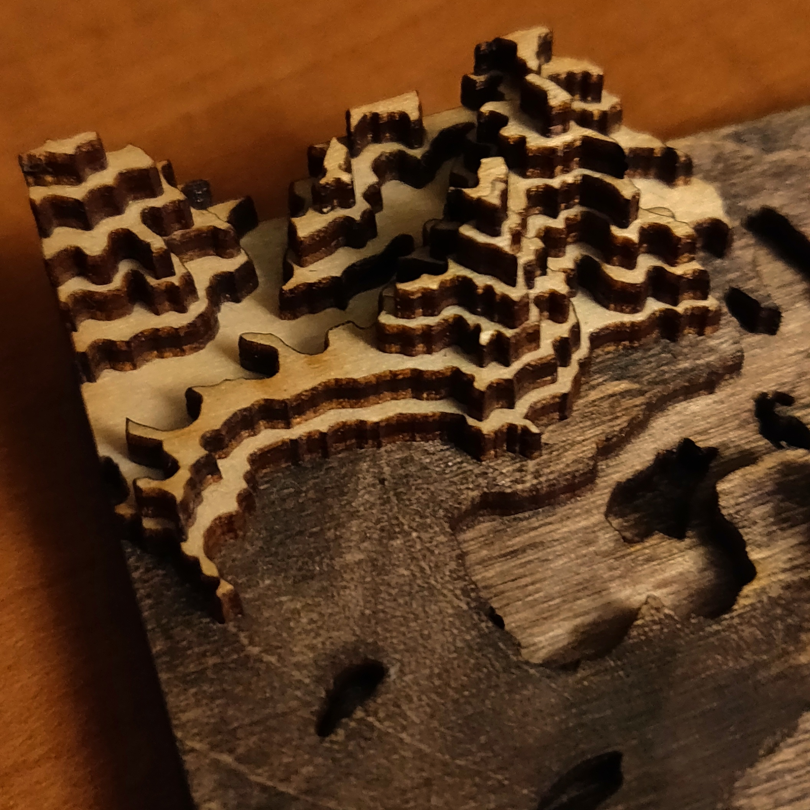
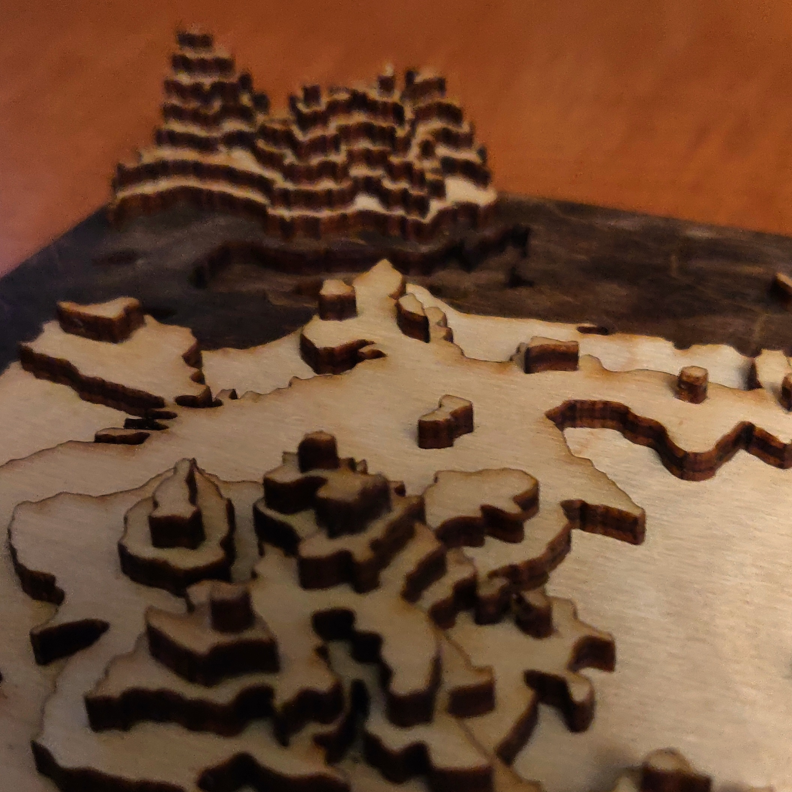

  
  
  
This was a fun project that I'd been meaning to do for a while. It was relatively straightforward to grab the contour data for a suitable region (with lines at 50m intervals), download it in a vector graphics format, and tweak it in Adobe Illustrator to get a clean map with relatively smooth lines and no impractically tiny pieces. Then, it was a matter of cutting the slices out of birch plywood using a later cutter, staining the pieces appropriately with a brush (dark stain for areas below ground and lighter stain for areas above ground), and gluing them together. I applied the glue with a tiny paintbrush before pressing it in place. Then, I painted the rastered label "San Francisco" with metallic gold acrylic paint. A few tips for anyone looking to recreate it (which I'd totally recommend, it cost me 20$ in supplies and made for a fun evening): (1) raster the next layer on each layer, which will make assembly easier, (2) raster the label as deep as possible (I didn't do it deep enough). I can imagine having a ton of fun making another one with my little brothers: this would be a lovely activity to do with kids as it's almost like a custom puzzle.

  
  

