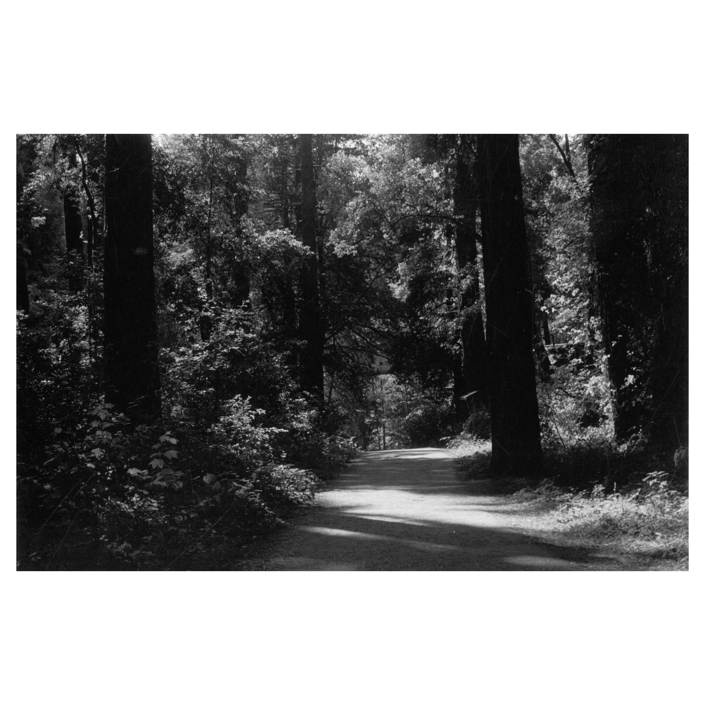
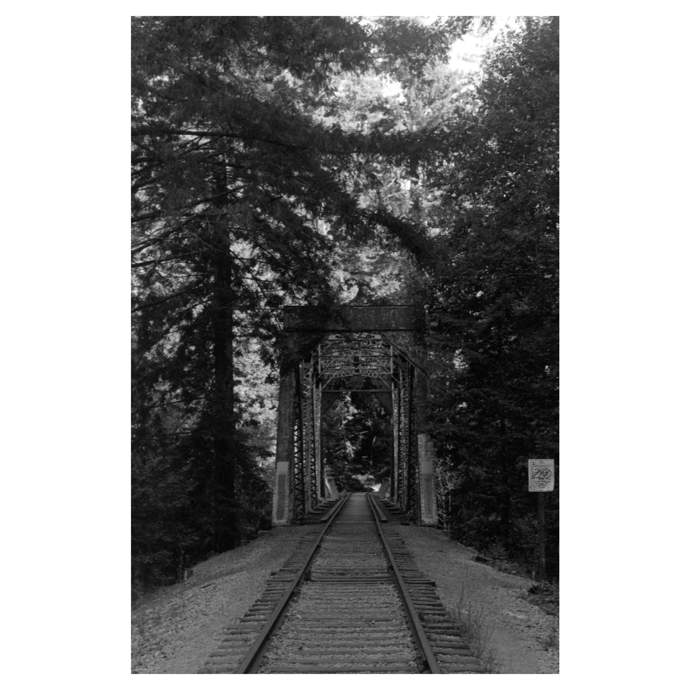
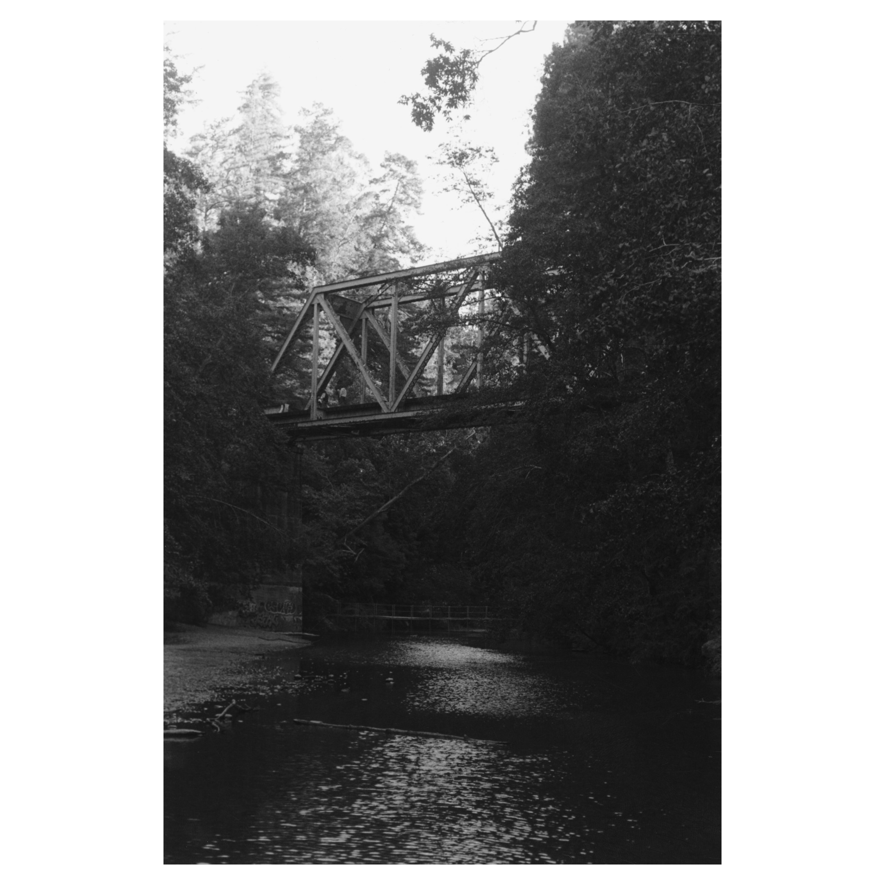

  
  
This series comes from the second roll of film I ever shot, taken while hiking along the railroad in Henry Cowell Redwoods State Park with my best friend, Max. The unused tracks have been converted into a trail following the path of a river canyon. A couple miles down the trail, there is a path down the canyon to a series of pools, flanked by green moss and flecked stone and great redwoods above that. These pools are called the Garden of Eden. For hours, Max and I swam in the crisp waters of the garden, and I watched him teach two teenagers the right spots to cliff dive from.

  
  
On the way back, as we crossed the bridge featured in the final two shots, I decided I wanted to wade out into the river. After gingerly holding my camera above the water, I made my way back to shore and started wiping my feet of the silt and sandwhich clung to it. Seeing me struggle to keep my feet and socks clean at the same time, Max knelt, taking my foot in his hands, and begun to wipe it off. The humble act of kindness, as casual it was, reminded me of the reverence in charan sparsh. Standing at a beautiful intersection of wrought metal and ancient trees, I felt in that moment like the whole world could be as iridescent as this place, if only we were willing to perform humble acts of kindness for nature, to Kneel and put on Their Socks.

  
  
This series was my first, and the quality of printing reflects that. The final shot could use more contrast to bring out detail in the upper trees and the water, and the first shot is slightly overexposed. The second shot was not properly focused, either in the initial capture or the grain alignment of the printing process. However. It is a initial project I am proud of, and captures accurately my interest in subjects: settings, rather than objects or people, caught in a moment of stillness. The latent imprint people leave on the world, rather than their explicit presence, is what draws my eye.

