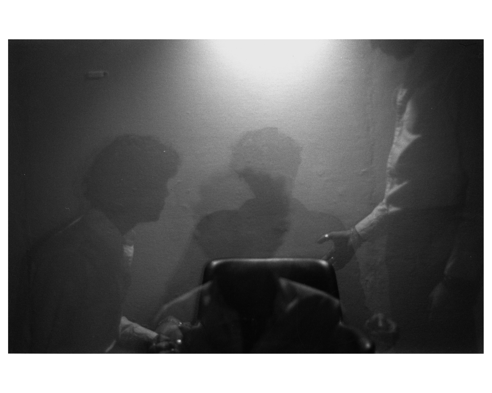
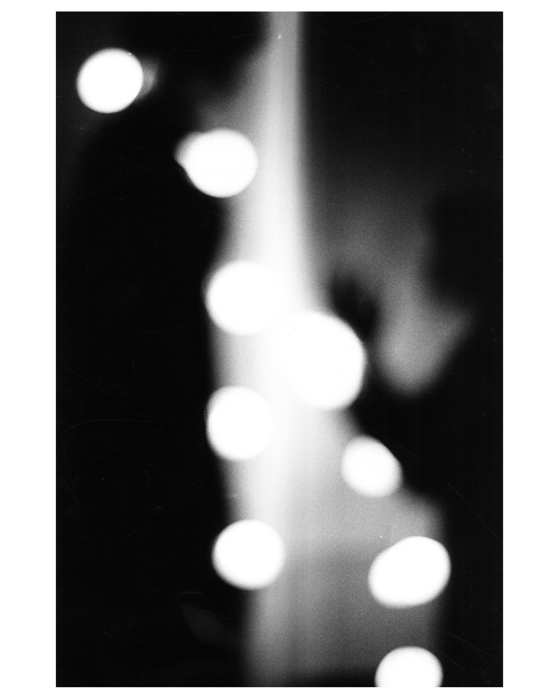
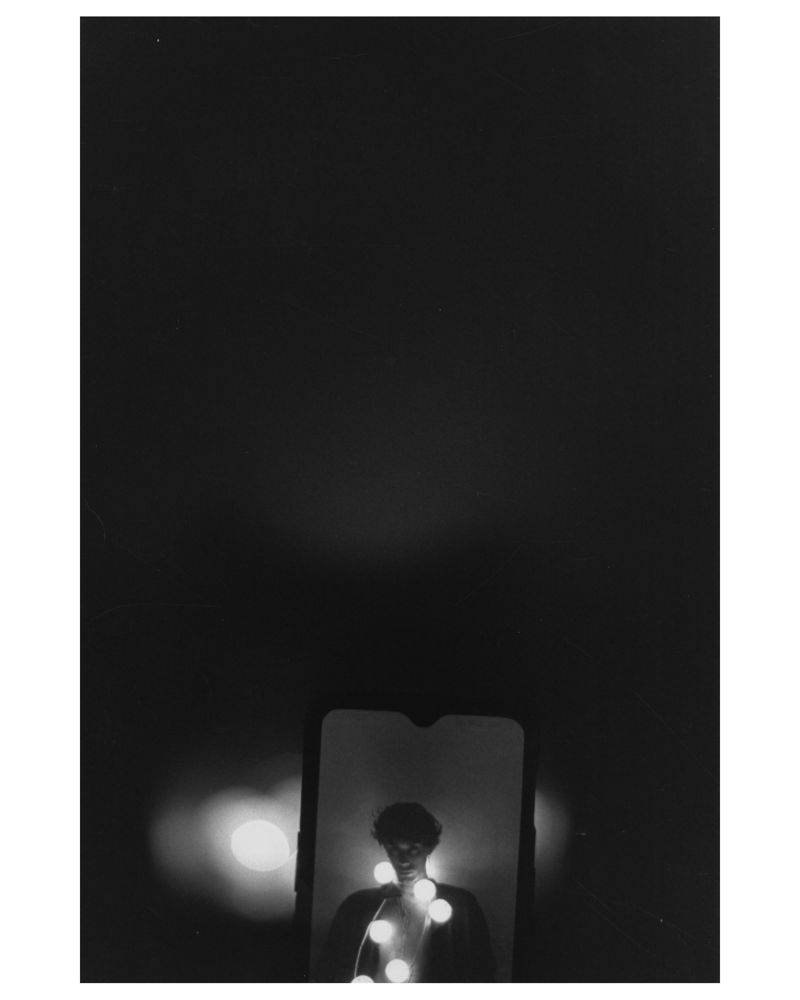
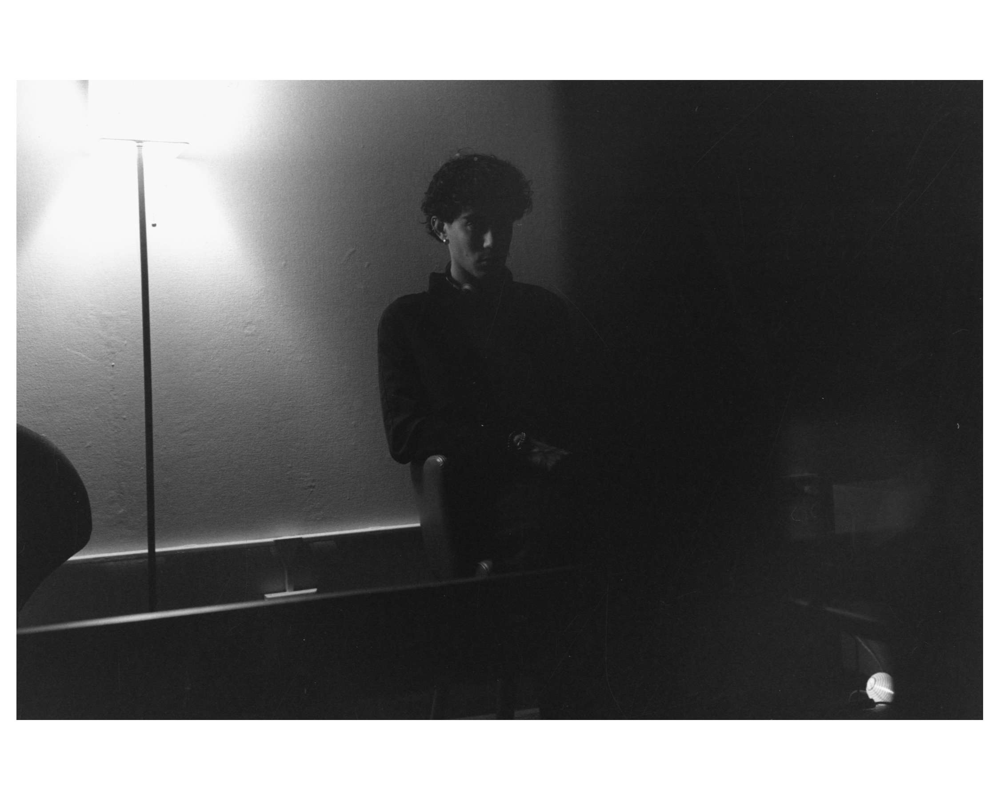
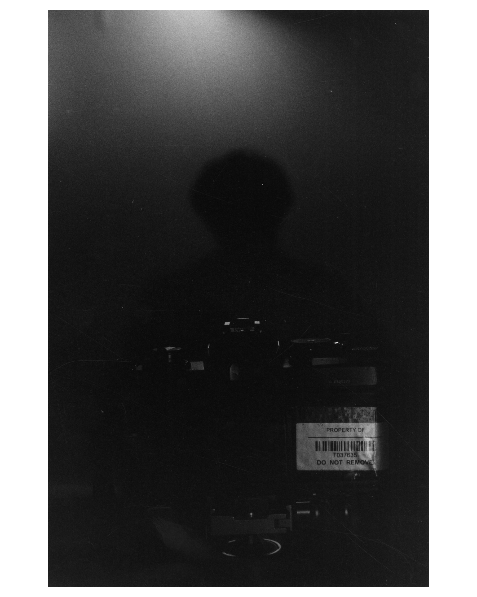
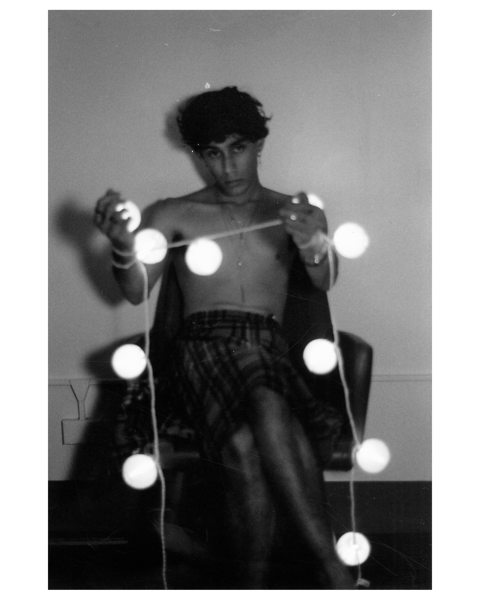
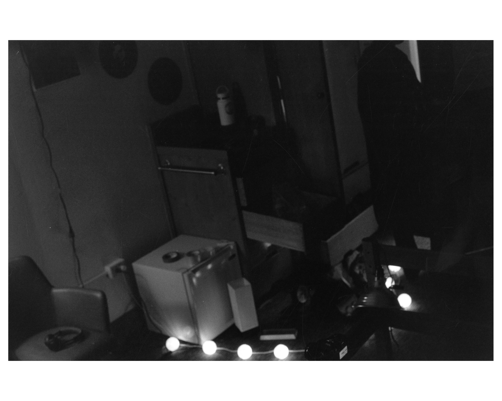
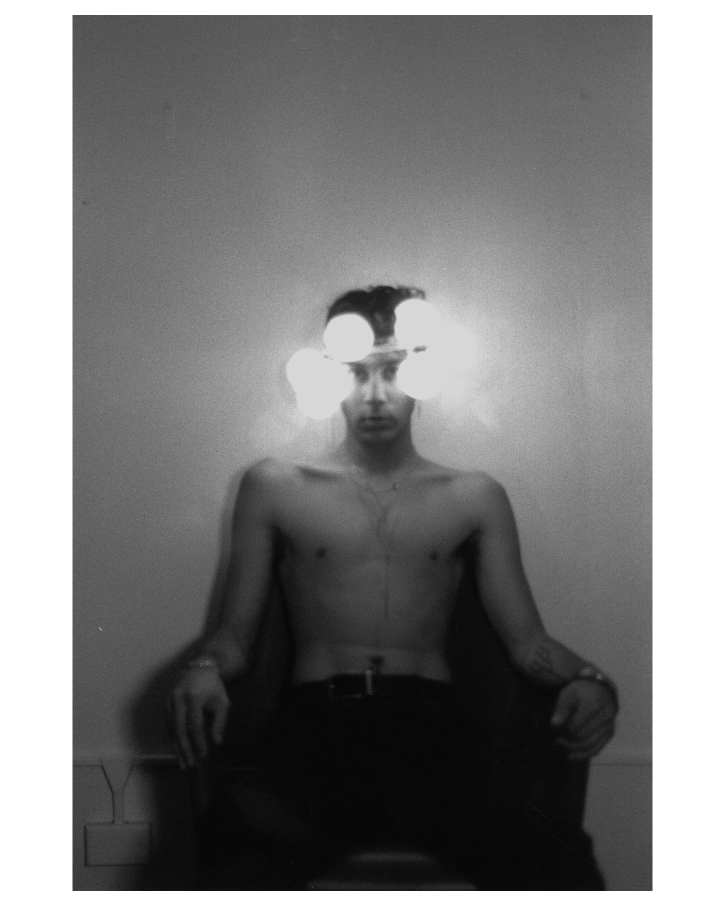
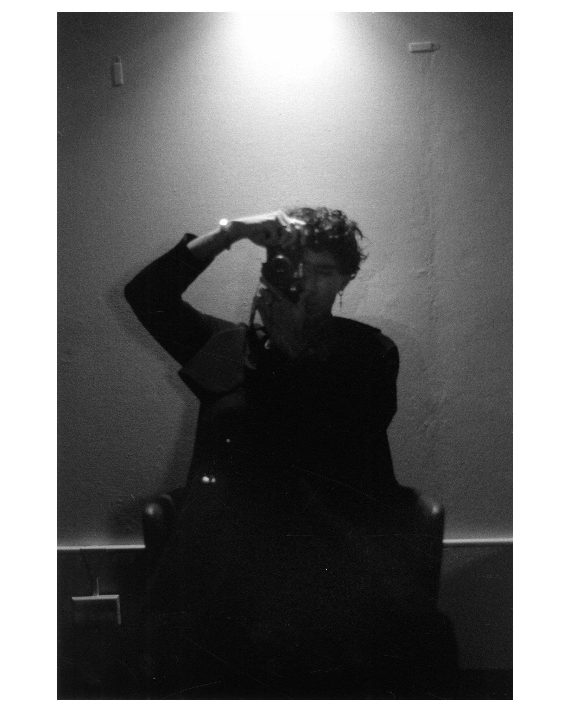

  
  

  
The name Roshan (रोशन) has roots in Persian, Sanskrit, and Hindi, and means "Shining Light". In this series, I explore how the lights we shine on ourselves and each other can be both liberating and oppressive. I reflect on the role of perspective and the camera on our self-perception, and take ownership of the way that I am seen by others. In this I was inspired by Francesca Woodman’s empowering deconstruction of the barrier between the photographer and the photographed through vulnerable self-portraiture.

  
Underlying this project are themes of race, gender, and sexuality, and their relationship to representations of my body. The violation of being repeatedly sexually harassed and told that it was because I looked "exotic" coexists with the gender euphoria of reclaiming my body with tattoos and piercings. Both are Shining Lights.

  
This series, more than anything, is aspirational, a personal act of rebellion. It was inspired by double printing in Little Tokyo’s photography studios, which used the practice to make composite photos of families separated by racist exclusion laws. These photographers rejected the traditional notion of photography as a perfect representation, but it’s more than that. They didn’t just alter reality, they asserted it. In editing families together, they genuinely did bring families together from across the ocean. In my series, many of the images have a technical quirk or are otherwise non-literal. Yet just like the double-printed family photos, they are assertions – of how I am seen and how I wish to be.

  

  
 – Roshan

  

  
  

  
  

  
  

  
  

  
  

  
  

  
  

  
  

  
  

