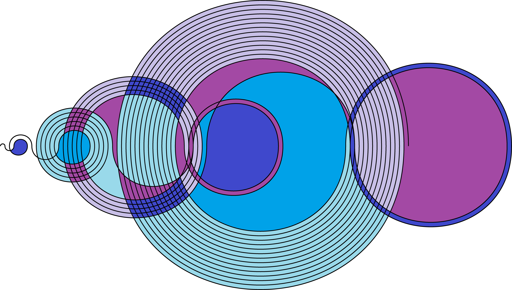
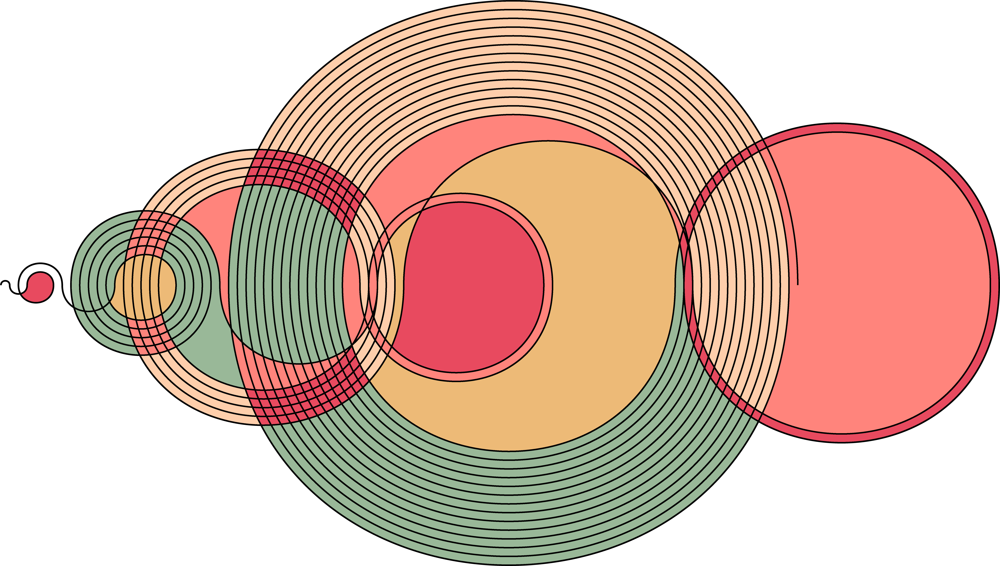
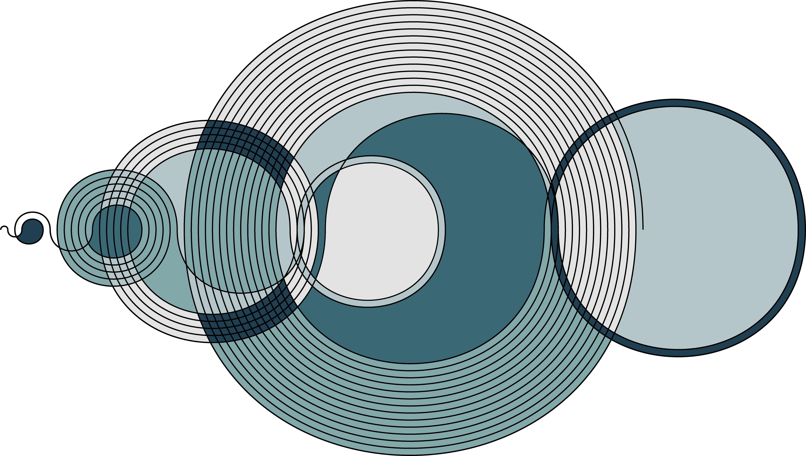
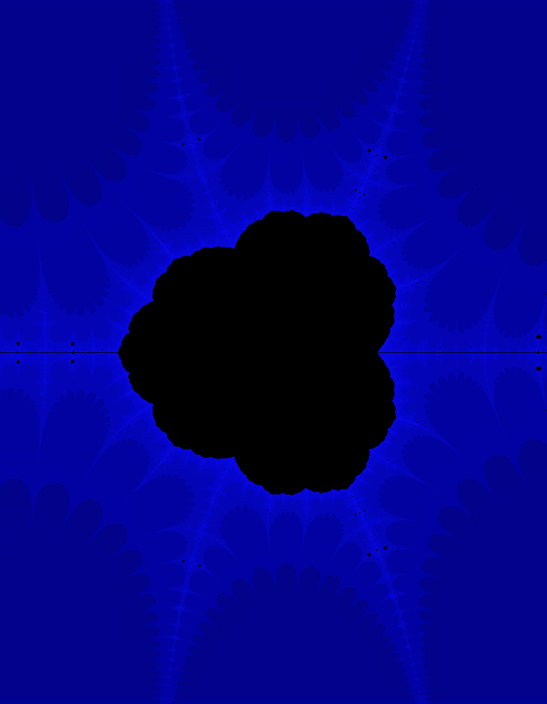
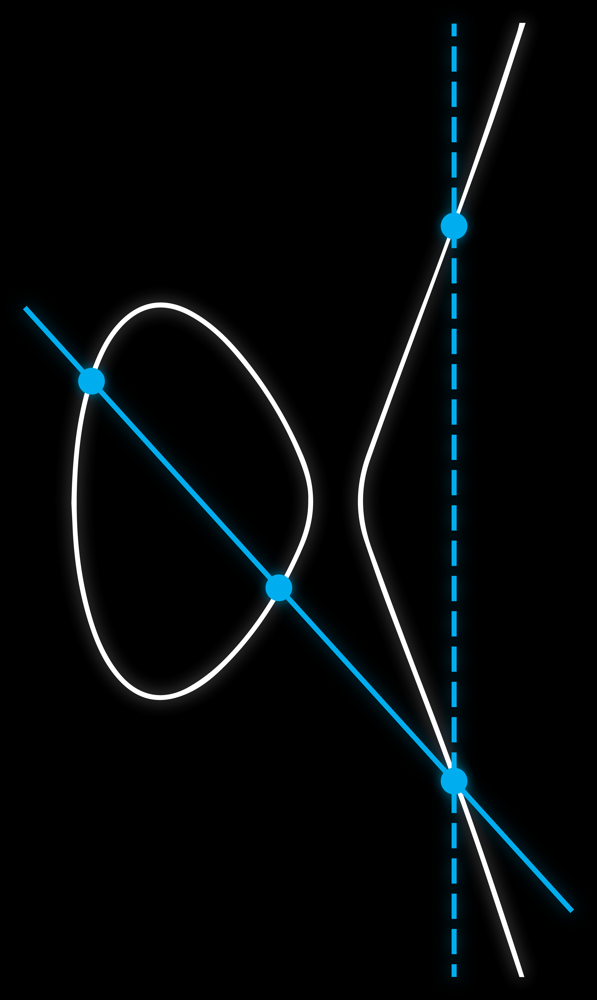
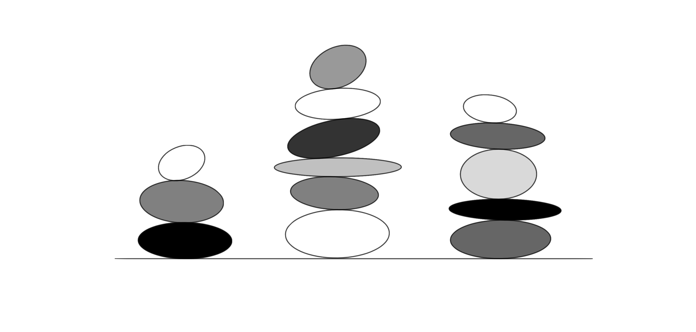
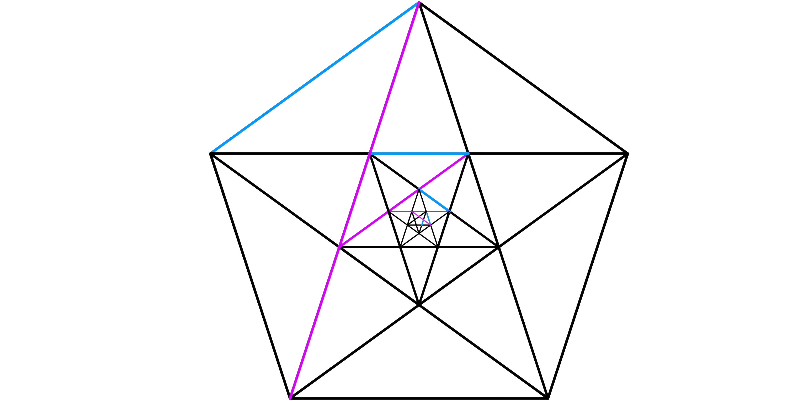
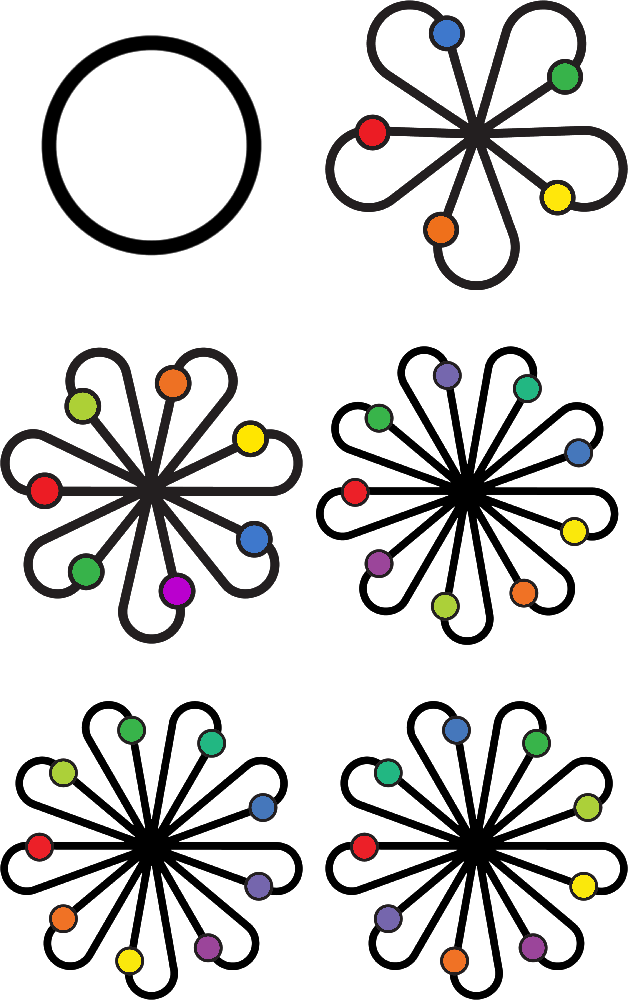

This post has art that I created a few years ago with a friend, Sonia, to make designs that would look good on math shirts. This is something of a dumping ground for those designs, so apologies for the lack of formatting and explanations.

 

 

 

 

 

 

 

 

 

 

 

 

 

 

 
